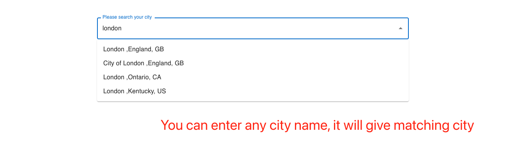
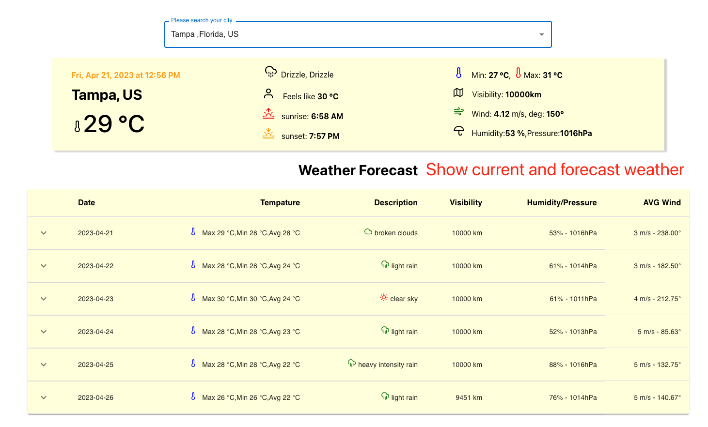

# Run docker
- ```docker build -f Dockerfile -t client .```
- ```docker run -it -p 4001:3000 client ```
- Open Browser, and enter url: http://localhost:4001/

# Technique tool chain
- React
    - seperate services layer and components
        - for service layer to deal with api request and roughly filter some data
        - for components only show data and solve some user interact action
            - Search, input city name, check possible cities.
                - debounce is necessary to optimize performance, avoid useless request
            - Forecast, weather forecast for one of city
            - Weather, show current city's current weather
    - I didn't use redux, because I am thinking this project is not complex, only two layer components, if I use redux, it's not useful. But if the project become complex, have more than three nested components, data flow is a big chanlenge, at that time, redux is good tool to manage the data flow.
- Material UI
    - USE material ui to show `table`, `autocomplete`
- react-feather
    - icon library to add some picture to the UI view.

# Demo



